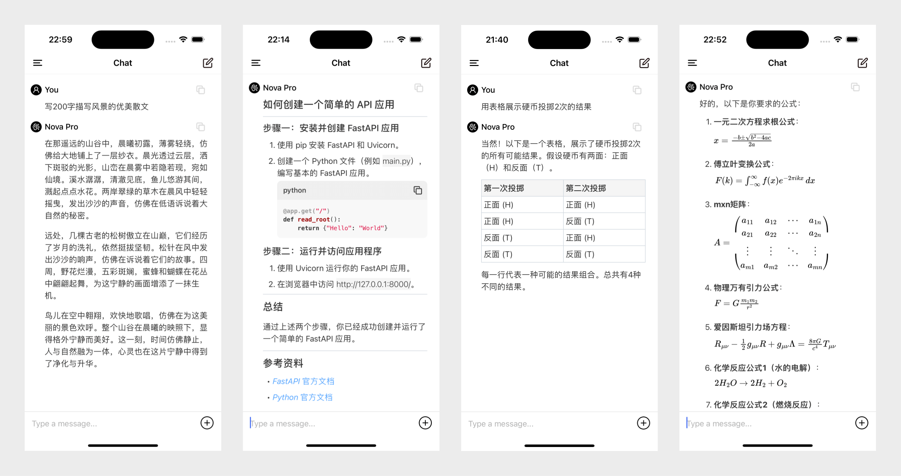
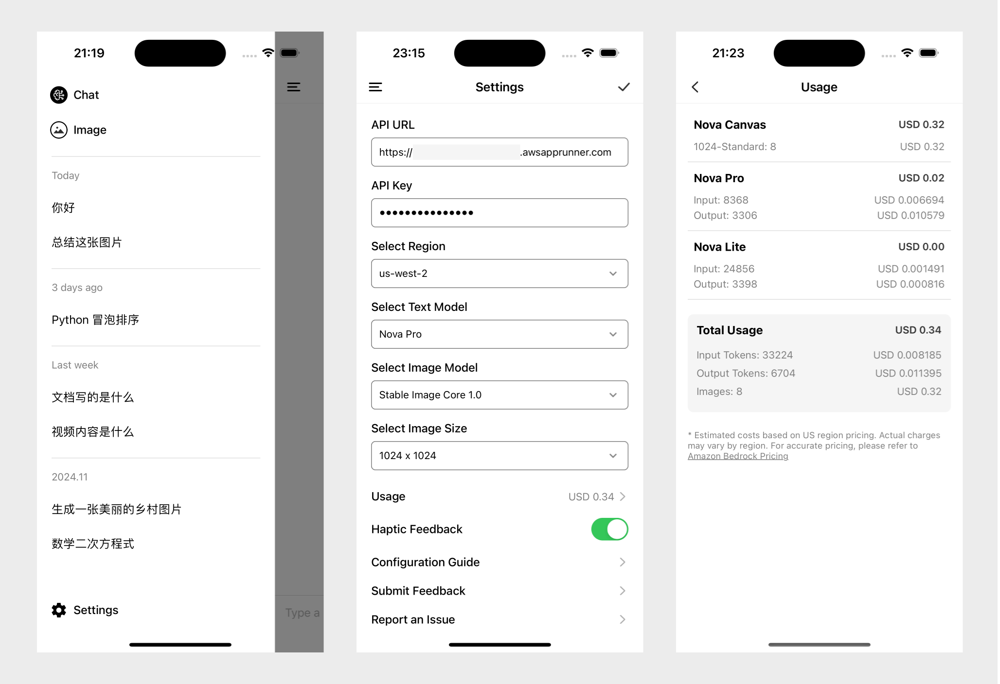

# SwiftChat - 跨平台 AI 聊天应用

> 🚀 您的私人 AI 助手 - 快速、安全、跨平台

[](https://github.com/aws-samples/swift-chat/releases)
[](LICENSE)

## 📱 快速下载

- [下载 Android 版本](https://github.com/aws-samples/swift-chat/releases/download/2.1.0/SwiftChat.apk)
- [下载 macOS 版本](https://github.com/aws-samples/swift-chat/releases/download/2.1.0/SwiftChat.dmg)
- iOS 版本：目前可通过 Xcode 本地构建使用

[English](/README.md)

SwiftChat 是一款快速响应的 AI 聊天应用，采用 [React Native](https://reactnative.dev/)
开发，并依托 [Amazon Bedrock](https://aws.amazon.com/bedrock/) 提供强大支持，同时兼容 Ollama、DeepSeek 和 OpenAI
等其他模型供应商。凭借其极简设计理念与坚实的隐私保护措施，该应用在 Android、iOS 和 macOS 平台上实现了实时流式对话及 AI
图像生成功能。


**主要特点:**

- 与 AI 进行实时流式聊天
- 支持丰富的 Markdown 渲染：表格、代码块、LaTeX 公式等
- 可实现完全自定义的系统提示词助手
- 带进度的 AI 图像生成
- 多模态支持（相机拍照、图片选择和文档上传）
- 对话历史记录列表查看和管理
- 跨平台支持（Android、iOS、macOS）
- 针对 iPad 和 Android 平板电脑进行 UI 优化
- 快速启动和响应性能
- 支持多种 AI 模型及切换 (
  包括 [Amazon Bedrock](https://aws.amazon.com/bedrock/)，[Ollama](https://github.com/ollama/ollama)，[DeepSeek](https://www.deepseek.com/)
  和 [OpenAI](https://openai.com/)，v1.10.0 的新功能 🎉)
- 支持完全自定义的系统提示词助手 (v1.9.0 的新功能 🎉)

**Amazon Nova 功能支持**

- 支持与 Amazon Nova Micro、Lite 和 Pro 进行流式对话
- 支持 Nova Lite 和 Pro 对图片、文档及视频内容的理解
- 支持直接在安卓和 iOS 设备上录制最长 30 秒的视频供 Nova 分析
- 支持自动压缩上传超过 8MB 的高清视频（1080p/4K）
- 支持通过自然语言让 Nova Canvas 生成图片，去除背景，替换背景，以及生成类似风格的图片
- 支持 Amazon Nova 系列 LaTeX 公式渲染（行内混排和单独显示模式）

### 功能展示

**多模态分析**：文本、图像、文档和视频

<div style="display: flex; flex-direction: 'row'; background-color: #888888;">


</div>


**系统提示词助手**: 提供实用的内置系统提示词，同时支持添加、编辑、排序和删除系统提示词来构建你自己的助手

<div style="display: flex; flex-direction: 'row'; background-color: #888888;">


</div>

**图像创作助手**：图像生成、风格复制、背景移除与替换

<div style="display: flex; flex-direction: 'row'; background-color: #888888;">


</div>

**丰富的 Markdown 支持**: 段落、代码块、表格、LaTeX 等



我们重新设计了用户界面，优化了字体大小和行间距，呈现出更优雅、清爽的视觉效果。这些功能也都完美适配了 Android 和 macOS
的原生界面，确保了流畅的使用体验。

> 注意： 为了方便展示，其中一些动图有加速处理。如您遇到动图卡顿的情况，请在电脑上使用 Chrome, Firefox 或者 Edge 浏览器进行查看。

## 架构


默认情况下，我们使用 **AWS App Runner**（通常用于托管 Python FastAPI 服务器），提供高性能、可扩展性和低延迟。

另外，我们提供使用 **AWS Lambda** 的 Function URL 替代 App Runner
的选项，以获得更具成本效益的解决方案，如 [示例](https://github.com/awslabs/aws-lambda-web-adapter/tree/main/examples/fastapi-response-streaming)
所示。

## 入门指南 - 使用 Amazon Bedrock 上的模型

### 前置条件

请确保您有权限访问 Amazon Bedrock 基础模型，SwiftChat 默认设置如下：

- 区域: `us-west-2`
- 文本模型: `Amazon Nova Pro`
- 图像模型: `Stable Diffusion 3.5 Large`

如果您要使用图片生成功能，请确保已开启 `Amazon Nova Lite` 模型的访问权限。您可以参考 [Amazon Bedrock 用户指南](https://docs.aws.amazon.com/bedrock/latest/userguide/model-access-modify.html) 来启用您的模型。

<details>
<summary><b>🔧 配置步骤（点击展开）</b></summary>

### 第 1 步: 设置 API Key

1. 登录您的 AWS 控制台并右键点击 [Parameter Store](https://console.aws.amazon.com/systems-manager/parameters/) 在新窗口中打开。
2. 检查您是否在 [支持的区域](#支持的区域)，然后点击 **创建参数** 按钮。
3. 完成以下参数填写，其他选项保持默认：
    - **名称**：输入参数名称(例如 "SwiftChatAPIKey"，该名称将在步骤 2 中用作 `ApiKeyParam`)。
    - **类型**：选择 `SecureString`。
    - **值**：任何不含空格的字符串（该值将在步骤 3 的应用设置中作为 `API Key` 使用）。
4. 点击 **创建参数**。

### 第 2 步: 部署堆栈并获取 API URL

1. 点击以下按钮中的一个，在 API Key 所在区域启动 CloudFormation 堆栈。

    - **App Runner**

      [](https://console.aws.amazon.com/cloudformation/home#/stacks/create/template?stackName=SwiftChatAPI&templateURL=https://aws-gcr-solutions.s3.amazonaws.com/swift-chat/latest/SwiftChatAppRunner.template)

    - **Lambda** (注意：仅供 AWS 客户使用)

      [](https://console.aws.amazon.com/cloudformation/home#/stacks/create/template?stackName=SwiftChatLambda&templateURL=https://aws-gcr-solutions.s3.amazonaws.com/swift-chat/latest/SwiftChatLambda.template)

2. 点击 **下一步**，在"指定堆栈详细信息"页面中提供以下信息:
    - 使用存储 API Key 的参数名填写`ApiKeyParam`(例如"SwiftChatAPIKey")。
    - 对于 App Runner，根据您的需求选择`InstanceTypeParam`。
3. 点击 **下一步**，保持 "配置堆栈选项" 页面默认设置，阅读功能并勾选底部的 "我确认，AWS CloudFormation 可能会创建 IAM 资源" 复选框。
4. 点击 **下一步**，在 "审核并创建" 中检查配置并点击 **提交**。

等待约 3-5 分钟部署完成，然后点击 CloudFormation 堆栈并转到 **输出** 选项卡，您可以找到 **API URL** 类似`https://xxx.xxx.awsapprunner.com` 或 `https://xxx.lambda-url.xxx.on.aws`。

### 第 3 步: 启动应用并设置 API URL 和 API Key

1. 启动应用，点击左侧菜单按钮，并点击底部的 **Settings**。
2. 粘贴`API URL`和`API Key` (Parameter Store 中您填写的**值**) 然后选择 Region。
3. 点击右上角 ✓ 图标保存配置并开始聊天。

恭喜 🎉 您的 SwiftChat 应用已准备就绪!
</details>

### 支持的区域

- 美国东部(弗吉尼亚北部):us-east-1
- 美国西部(俄勒冈):us-west-2
- 亚太地区(孟买):ap-south-1
- 亚太地区(新加坡):ap-southeast-1
- 亚太地区(悉尼):ap-southeast-2
- 亚太地区(东京):ap-northeast-1
- 加拿大(中部):ca-central-1
- 欧洲(法兰克福):eu-central-1
- 欧洲(伦敦):eu-west-2
- 欧洲(巴黎):eu-west-3
- 南美洲(圣保罗):sa-east-1

## 入门指南 - 使用其他模型提供商

<details>
<summary><b>🔧 配置 Ollama（点击展开）</b></summary>

1. 进入 **设置页面**，选择 **Ollama** 标签。
2. 输入您的 Ollama 服务器 URL。例如：
    ```bash
    http://localhost:11434
    ```
3. 输入正确的服务器 URL 后，您可以从 **文本模型** 下拉列表中选择所需的 Ollama 模型。

</details>

<details>
<summary><b>🔧 配置 DeepSeek（点击展开）</b></summary>

1. 进入 **设置页面**，选择 **DeepSeek** 标签。
2. 输入您的 DeepSeek API 密钥。
3. 从 **文本模型** 下拉列表中选择 DeepSeek 模型。目前支持以下 DeepSeek 模型：
    - `DeepSeek-V3`
    - `DeepSeek-R1`

</details>

<details>
<summary><b>🔧 配置 OpenAI（点击展开）</b></summary>

1. 进入 **设置页面**，选择 **OpenAI** 标签。
2. 输入您的 OpenAI API 密钥。
3. 从 **文本模型** 下拉列表中选择 OpenAI 模型。目前支持以下 OpenAI 模型：
    - `GPT-4o`
    - `GPT-4o mini`

此外，如果您已部署 [ClickStream Server](#第-2-步-部署堆栈并获取-api-url)，可以启用 **Use Proxy** 选项以转发您的请求。

</details>

## 详细功能

**快捷工具**：代码复制、选择模式、页面滚动和 Token 使用统计

<div style="display: flex; flex-direction: 'row'; background-color: #888888;">


</div>

我们还拥有简洁的历史记录，设置页面，和直观的 Usage 统计页面：



对于 Mac 版本，我们不仅支持历史记录的显示，还在 1.9.0 版本后添加了侧边栏固定显示模式，如下是在 Mac 上演示如何添加自定义系统提示词的动画。


### 消息处理

- [x] 文本复制支持：
    - 点击消息标题栏右侧的复制按钮
    - 点击代码块右上角的复制按钮
    - 在 macOS 上可直接选择并复制代码（iOS 上双击或长按）
    - 长按文本复制整句（macOS 上点击右键）
- [x] 通过点击消息标题或双击文本启用文本选择模式
- [x] 历史消息按时间线展示
- [x] 在历史记录中长按可删除消息
- [x] 点击预览上传的文档和图片
- [x] 同时支持问题和回答的 Markdown 格式显示
- [x] 支持表格显示和代码语法高亮
- [x] 每个会话最多支持上传 20 张图片和 5 个文档

### 图片功能

- [x] 支持使用中文生成图片（确保在所选区域启用了 `Amazon Nova Lite`）
- [x] 支持点击查看和缩放生成的图片
- [x] 长按图片可保存或分享
- [x] 自动压缩上传图片以提升响应速度

### 用户体验

- [x] Android 和 iOS 设备支持触感反馈（可在设置中关闭）
- [x] 支持 Android/iOS 设备横屏模式
- [x] 双击标题栏回到顶部
- [x] 点击底部箭头查看最新消息
- [x] 点击聊天标题查看当前会话的 token 使用情况
- [x] 在设置中查看详细的 token 使用情况和图片生成数量
- [x] 应用内升级提示（Android 和 macOS）

我们针对横屏做了相应优化，下图展示了通过横屏模式您可以很好地阅读表格和代码内容。


## 是什么让 SwiftChat 如此"迅速"?

🚀 **快速启动速度**

- 得益于 RN Hermes 引擎的 **AOT**（提前编译）
- 实现了复杂组件的 **延迟加载**
- 支持**应用秒开**，启动后可直接输入

🌐 **快速请求速度**

- 通过**图像压缩**加速端到端 API 请求
- 在与 Bedrock **相同区域**部署 API 以提供更低延迟

📱 **快速渲染速度**

- 使用`useMemo`和自定义缓存为会话内容创建二级缓存
- 减少不必要的重新渲染并加快流式消息显示
- 所有 UI 组件都渲染为**原生组件**

📦 **快速存储速度**

- 通过使用 **react-native-mmkv** 消息可以比 AsyncStorage **快 10 倍** 读取、存储和更新
- 优化会话内容和会话列表存储结构以加快历史记录列表显示

## 应用隐私和安全

- 加密 API Key 的存储
- 最小权限要求
- 数据仅本地存储
- 无用户行为跟踪
- 无数据收集
- 隐私优先策略

## 构建和开发

首先，克隆此仓库。所有 App 代码位于 react-native 文件夹中。在继续之前，请执行以下命令来下载依赖项。

```bash
cd react-native && npm i && npm start 
```

### 构建 Android

在新的终端中执行：

```bash
npm run android
```

## 构建 iOS

先打开一个新的终端，如果是第一次运行，请先执行 `cd ios && pod install && cd ..` 来安装原生依赖，然后运行：

```bash
npm run ios
```

### 构建 macOS

1. 执行 `npm start`。
2. 双击 `ios/SwiftChat.xcworkspace` 在 Xcode 中打开项目。
3. 将构建目标更改为 `My Mac (Mac Catalyst)` 然后点击 ▶ 运行按钮。

## API 参考

请参考 [API Reference](server/README.md)

## 如何升级？

### 升级应用程序

- **Android** 和 **macOS**：导航到 **Settings** 页面，如果有新版本，您将在页面底部找到它，然后点击应用版本号进行下载和安装。
- **iOS**：如果在 [Release 页面](https://github.com/aws-samples/swift-chat/releases) 上发布了新版本，
  请更新您的本地代码，在 Xcode 中重新构建并安装您的应用程序。

**提示**：下载新版本后，请查看版本发布说明，确认是否需要同步更新 API 版本。

### 升级 API

- **对于 AppRunner**：点击并打开 [App Runner Services](https://console.aws.amazon.com/apprunner/home#/services) 页面，
  找到并打开 `swiftchat-api`，点击右上角的 **部署** 按钮。
- **对于 Lambda**：点击并打开 [Lambda Services](https://console.aws.amazon.com/lambda/home#/functions) 页面，找到并打开
  以 `SwiftChatLambda-xxx` 开头的 Lambda 函数，点击 **部署新镜像** 按钮并点击保存。

## 安全

更多信息请参见 [CONTRIBUTING](CONTRIBUTING.md#security-issue-notifications)。

## 许可证

该库使用 MIT-0 许可证。详见 [LICENSE](/LICENSE) 文件。
